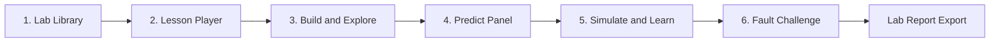

# Circuit Lab Simulator — Education Edition

An interactive **education simulator** for learning DC circuit analysis. Students build textbook-aligned circuits, make predictions, run simulations, and diagnose intentional faults — all in a guided lab environment.

> **Positioning:** Learn circuits by building, predicting, simulating, and diagnosing — not by trusting a black-box fault detector.

---

## Quick start

### Backend

```bash
pip install -r backend/requirements.txt
# Ensure ngspice is installed and on PATH
cd backend && python main.py
```

### Frontend

```bash
cd frontend && npm install && npm run dev
```

Open **http://localhost:5173** — the Lab Library is the home screen.

---

## The six screens

The education simulator is organized around six core screens/flows. This document describes each one, what it teaches, and how it maps to the codebase.



---

### Screen 1 — Lab Library (Home)

**File:** `frontend/src/pages/LabLibrary.jsx`

**Purpose:** Give students a structured entry point instead of a blank canvas.

**What students see:**
- Modules grouped by topic (Basics, Ch.3 Dividers, Series/Parallel, Current Division, Fault Lab)
- Lesson cards with difficulty, duration, textbook reference, and progress status
- **Start lab** opens a guided lesson; **Free Play** opens the open sandbox editor

**Progress tracking:** Lesson status (`not_started`, `in_progress`, `completed`) is stored in `localStorage` via `frontend/src/utils/progressStorage.js`.

**Lesson catalog:** Defined in `frontend/src/data/lessons.js` — 8 labs covering Nilsson-aligned circuits from `src/dataset_generator.py`.

---

### Screen 2 — Lesson Player (Guided sidebar)

**File:** `frontend/src/pages/LessonPlayer.jsx`

**Purpose:** Turn the sandbox into a step-by-step lab with objectives and navigation.

**Layout:**
| Left sidebar | Right panel |
|---|---|
| Learning objectives | Circuit canvas (pre-loaded preset) |
| All lab steps (highlighted) | Component sidebar |
| Current step instructions | Run simulation button |

**Step types** (defined per lesson in `lessons.js`):

| Type | What it does |
|---|---|
| `observe` | Read the circuit setup and given values |
| `predict` | Answer a question before simulating |
| `action` | Perform a task (close switch, add meter, simulate) |
| `verify` | Compare results to expected textbook answer |
| `explore` | Free experimentation within the lesson |

**Preset loading:** Selecting a lesson loads a hand-crafted circuit via `frontend/src/utils/presetCircuitLoader.js`.

---

### Screen 3 — Build and Explore

**Files:** `frontend/src/components/CircuitCanvas.jsx`, `frontend/src/components/ComponentSidebar.jsx`

**Purpose:** Hands-on circuit building with scaffolding.

**Features:**
- Drag-and-drop components onto the canvas
- Pre-loaded preset circuits for each lesson (no manual wiring from scratch)
- Edit component values, toggle switches, rotate components (`Ctrl+R`)
- Free Play mode: full sandbox with no lesson constraints

**Education copy:** The app title is **Circuit Lab Simulator** (not "Fault Detector").

---

### Screen 4 — Predict Panel

**File:** `frontend/src/components/PredictPanel.jsx`

**Purpose:** Active learning — predict before you simulate.

**Flow:**
1. Student reads a predict step ("What is vo across R2?")
2. Enters a number or selects a choice
3. Locks prediction
4. Runs simulation and compares

**Grading:** Numeric answers use a tolerance band (default ±5%). Choice questions require an exact match.

**Example (Nilsson Ex 3.2):**
- Question: vo with Vs=100V, R1=25kΩ, R2=100kΩ
- Expected: **80 V**
- Hint: `vo = Vs × R2 / (R1 + R2)`

---

### Screen 5 — Simulate and Learn (Results)

**File:** `frontend/src/pages/ResultsPage.jsx`

**Purpose:** Show simulation results in student-friendly language.

**Sections (education mode labels):**

| Section | Education label | What it shows |
|---|---|---|
| Status banner | ✓ / ⚠ summary | Circuit OK, open switch, or wiring issue |
| Components | 🔬 Components | Per-component voltage, current, power |
| Value drift | 📊 Component value changed | Which component deviated from nominal |
| Wiring | 🔌 Wiring check | Structural faults (floating nodes, meter placement) |
| Analysis | 🔎 What's happening? | Pattern analysis (replaces "ML Classification") |

**Visual feedback:** Bulb brightness (`bright` / `dim` / `off`), switch open/closed state.

**Export:** **Export lab notes** generates a PDF via `/api/generate-report-pdf`.

---

### Screen 6 — Fault Challenge (Detective mode)

**File:** `frontend/src/components/DiagnoseChallenge.jsx`

**Purpose:** Gamified fault diagnosis — the unique education hook.

**How it works:**
1. Lesson loads a preset circuit with a **hidden injected fault** (e.g. R2 partial open ×3)
2. Student simulates and inspects readings
3. Submits diagnosis: component + fault type
4. System reveals correct answer with explanation

**Fault injection:** Handled in `presetCircuitLoader.js` — modifies component `value` while preserving `nominalValue` for drift detection.

**Labs with challenges:**
- **Lab 6:** Diagnose the Drift (`nilsson_assess3_2_divider`, R2 partial open)
- **Lab 7:** Multi-Source Mystery (`nilsson_ex2_8_multi_source`, R3 partial short)

---

## Curriculum (8 labs)

| Lab | Module | Circuit key | Textbook ref |
|---|---|---|---|
| Lab 0: Switch & Bulb | Basics | `switch_bulb` | — |
| Lab 1: Divider Basics | Basics | `voltage_divider_12k_9k` | Custom |
| Lab 2: Voltage Divider | Ch.3 Dividers | `nilsson_ex3_2_divider` | Nilsson Ex 3.2 |
| Lab 3: Series-Parallel | Ch.3 S/P | `nilsson_ex3_1_series_parallel` | Nilsson Ex 3.1 |
| Lab 4: Current Division | Ch.3 Current | `nilsson_ex3_4_current_division` | Nilsson Ex 3.4 |
| Lab 5: Meter Placement | Basics | `nilsson_ex3_2_divider` | — |
| Lab 6: Diagnose the Drift | Fault Lab | `nilsson_assess3_2_divider` + fault | Assess 3.2 |
| Lab 7: Multi-Source Mystery | Fault Lab | `nilsson_ex2_8_multi_source` + fault | Ex 2.8 |

---

## Project structure (education additions)

```
frontend/src/
├── data/
│   └── lessons.js              # Lesson catalog, steps, challenges
├── pages/
│   ├── LabLibrary.jsx          # Screen 1: Home
│   ├── LabLibrary.css
│   ├── LessonPlayer.jsx        # Screen 2: Guided lab
│   ├── LessonPlayer.css
│   └── ResultsPage.jsx         # Screen 5: Results (educationMode prop)
├── components/
│   ├── PredictPanel.jsx        # Screen 4: Predict loop
│   ├── DiagnoseChallenge.jsx   # Screen 6: Fault challenge
│   └── CircuitCanvas.jsx       # presetLoad prop for lesson circuits
└── utils/
    ├── presetCircuitLoader.js  # Preset circuit definitions
    └── progressStorage.js      # localStorage progress tracking
```

---

## UI copy guide (education vs diagnostic)

| Diagnostic (old) | Education (new) |
|---|---|
| Circuit Fault Detector | Circuit Lab Simulator |
| Simulate | Run simulation |
| ML Classification | What's happening? |
| Value Drift Detected | Component value changed |
| Structural Faults | Wiring check |
| Generate Report | Export lab notes |
| Back to editor | Back to lab |

---

## Backend (unchanged)

The FastAPI backend (`backend/main.py`) still handles:
- Circuit validation
- SPICE netlist generation (DC analysis)
- ngspice simulation
- Structural fault detection
- Pattern analysis and drift warnings
- PDF report generation
- Optional RAG explanations (`/api/explain-fault`)

The education frontend uses the same `/api/simulate` endpoint as before.

---

## Roadmap (post-v1)

| Priority | Feature |
|---|---|
| P1 | Parameter sweep sliders (what-if without rebuilding) |
| P1 | Animated current flow on canvas |
| P2 | Interactive KCL panel at selected nodes |
| P2 | Teacher dashboard and shareable lab links |
| P3 | Transient analysis (RC charging) |
| P3 | Hosted deployment (no local ngspice install) |

---

## Branch

This education simulator foundation lives on branch:

```
feature/education-simulator-v1
```

---

## License

See repository root for license information.
